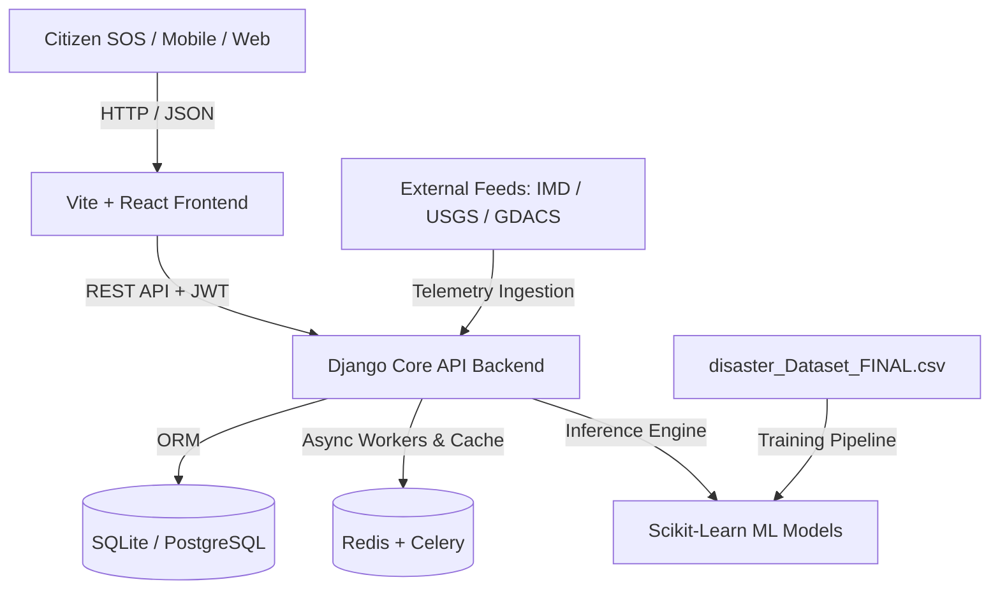

# 🚨 AI-Powered Emergency Response Intelligence Platform (ERIP India)

An integrated, enterprise-grade emergency operations command platform designed for national and state disaster management authorities (NDRF, SDRF, Fire & Rescue, Medical Corps). ERIP India combines **geospatial intelligence**, **real-time citizen SOS triage**, **NLP distress classification**, and **machine learning predictive models** to optimize rescue team dispatch and disaster relief logistics.

---

## ⚡ QUICK START COMMANDS (COPY & PASTE)

### 🖥️ Terminal 1 — START BACKEND (Django)
```powershell
cd c:\Users\2002h\Desktop\disaster_data_project\backend
..\venv\Scripts\activate
python manage.py runserver 0.0.0.0:8000
```
👉 *Open in Browser: [http://localhost:8000/admin/](http://localhost:8000/admin/)*

### 🌐 Terminal 2 — START FRONTEND (React)
```powershell
cd c:\Users\2002h\Desktop\disaster_data_project\frontend
npm run dev
```
👉 *Open in Browser: [http://localhost:5173](http://localhost:5173)*

### 🔑 Login Credentials
- **Email:** `admin@erip.in`
- **Password:** `password123`

---

## 📑 Table of Contents
1. [Architecture & Technology Stack](#-architecture--technology-stack)
2. [Project Structure](#-project-structure)
3. [Quick Start & Running the Platform](#-quick-start--running-the-platform)
4. [User Roles: Admin vs Standard User](#-user-roles-admin-vs-standard-user)
5. [Using the 141MB Disaster Dataset & AI Training](#-using-the-141mb-disaster-dataset--ai-training)
6. [Data Security, Hardening & Compliance](#-data-security-hardening--compliance)
7. [API Reference Summary](#-api-reference-summary)

---

## 🏗️ Architecture & Technology Stack



- **Frontend**: React 19, Vite, Leaflet Maps, Lucide Icons, Recharts, Zustand (State Management), Vanilla CSS Dark Glassmorphism.
- **Backend**: Django 5 / 6, Django REST Framework (DRF), SimpleJWT (Token Auth), Django Channels (WebSockets), Django Filters.
- **AI & Machine Learning**: Python 3.13, Scikit-learn (`HistGradientBoostingRegressor`), Pandas, NumPy, Joblib, spaCy NLP.
- **Database**: SQLite (Zero-config development) with seamless one-switch PostgreSQL production readiness.

---

## 📁 Project Structure

```
disaster_data_project/
├── disaster_Dataset_FINAL.csv       # 141MB Master India Disaster Dataset (127 features)
├── README.md                        # Platform guide & documentation
├── venv/                            # Central Python virtual environment
├── backend/                         # Django Backend Application
│   ├── manage.py                    # Django CLI management script
│   ├── seed_data.py                 # Initial database seeding script
│   ├── db.sqlite3                   # Development SQLite database
│   ├── ai_models/                   # Exported trained ML models (.pkl)
│   ├── core/                        # Django configuration (settings, ASGI/WSGI, root URLs)
│   ├── accounts/                    # User models, authentication, and agency management
│   ├── incidents/                   # Incidents, SOS reports, field updates API & models
│   ├── resources/                   # Rescue equipment and logistics inventory
│   ├── volunteers/                  # First responder and medical corps rosters
│   ├── ai_engine/                   # ML training pipelines and NLP inference
│   │   └── train_model.py           # Training pipeline script for dataset
│   ├── analytics/                   # Vulnerability indexing and trend analysis
│   ├── comms/                       # Mass SMS (Twilio) & tactical radio channels
│   └── external_data/               # IMD, USGS, and GDACS sensor telemetry feeds
└── frontend/                        # React + Vite Frontend
    ├── index.html                   # HTML entry point with Leaflet & font dependencies
    ├── vite.config.js               # Vite bundler configuration
    ├── package.json                 # Node dependencies
    └── src/
        ├── App.jsx                  # Route guards & application structure
        ├── index.css                # Dark glassmorphism design system
        ├── api/client.js            # Axios API client with automatic JWT token refresh
        ├── store/index.js           # Zustand stores (Auth, Incidents, UI state)
        ├── components/              # Reusable UI (Sidebar, Topbar, KPI cards)
        └── pages/                   # Operational pages (Dashboard, LiveMap, Incidents, SOS, AI)
```

---

## 🚀 Step-by-Step Instructions for Running the Project

You need **two separate terminals** running at the same time: one for the **Django Backend** and one for the **React Frontend**.

---

### 📋 Prerequisites Check
- **Operating System**: Windows (PowerShell or Command Prompt)
- **Python**: Installed in `venv\` (Python 3.10+)
- **Node.js & npm**: Node.js v18+ installed

---

### 🟢 First-Time Setup (Run Once Only)

If this is your first time setting up the project on a new machine:

#### 1. Setup Backend Database & Demo Data
Open **Terminal 1** in the project root folder (`c:\Users\2002h\Desktop\disaster_data_project`):
```powershell
# 1. Activate the Virtual Environment
.\venv\Scripts\activate

# 2. Go to backend directory
cd backend

# 3. Create database tables
python manage.py makemigrations accounts incidents resources volunteers alerts comms ai_engine analytics external_data
python manage.py migrate

# 4. Populate realistic demo agencies, incidents, and admin user
python seed_data.py

# 5. (Optional) Train the Machine Learning models using the 141MB dataset
python ai_engine/train_model.py
```

#### 2. Install Frontend Dependencies
Open **Terminal 2** in the project root folder:
```powershell
# Go to frontend directory
cd frontend

# Install Node modules
npm install
```

---

### ▶️ Everyday Running Instructions

Every time you want to run the project, follow these two simple steps:

#### 🖥️ Terminal 1: Start the Backend Server (API & Database)

> ⚠️ **Important**: Your virtual environment `venv` is located in the **project root folder**, not inside `backend/`.

**Option A (Recommended — from project root):**
```powershell
# 1. Start in the project root folder
cd c:\Users\2002h\Desktop\disaster_data_project

# 2. Activate the virtual environment FIRST (in the root)
.\venv\Scripts\activate

# 3. Now enter backend and run server
cd backend
python manage.py runserver 0.0.0.0:8000
```

**Option B (If you are already inside `backend/`):**
```powershell
# Activate using ..\ (points to venv in parent root folder)
..\venv\Scripts\activate

# Start the server
python manage.py runserver 0.0.0.0:8000
```
> **Backend Status**: Once you see `Starting development server at http://0.0.0.0:8000/`, your backend is **LIVE**!

---

#### 🌐 Terminal 2: Start the Frontend Application (UI & Maps)
Open a **new terminal window**:
```powershell
# 1. Navigate to the frontend directory
cd c:\Users\2002h\Desktop\disaster_data_project\frontend

# 2. Start the Vite development server
npm run dev
```
> **Frontend Status**: Once you see `Local: http://localhost:5173/`, your frontend is **LIVE**!

---

### 🔗 How to Access the Platform

Once both terminals are running, open your web browser:

| Application / Page | Browser URL | Default Credentials | Description |
| :--- | :--- | :--- | :--- |
| **Emergency Operations Platform** | [http://localhost:5173](http://localhost:5173) | `admin@erip.in` / `password123` | Main dark-glassmorphism dashboard, live map, SOS queue & AI triage |
| **Django Master Admin** | [http://localhost:8000/admin/](http://localhost:8000/admin/) | `admin@erip.in` / `password123` | Backend database management (manage users, roles, agencies, incidents) |
| **Backend REST API** | [http://localhost:8000/api/v1/incidents/](http://localhost:8000/api/v1/incidents/) | JWT Bearer Token | Raw JSON API endpoints |

---

### 🛠️ Common Troubleshooting

- **Error: `Port 8000 is already in use`**:
  Another instance of Django is still running. In PowerShell, terminate it with:
  ```powershell
  Get-Process python* | Stop-Process
  ```
- **Error: `No module named django`**:
  Make sure you activated the virtual environment (`.\venv\Scripts\activate`) or use `..\venv\Scripts\python.exe manage.py runserver`.
- **Error: `Port 5173 is already in use`**:
  Vite will automatically try port 5174 or you can stop existing node processes with:
  ```powershell
  Get-Process node* | Stop-Process
  ```
- **Need to re-seed or reset demo data**:
  ```powershell
  cd backend
  python seed_data.py
  ```

---

## 👥 User Roles: Admin vs Standard User

### 🔑 Default Demo Accounts

| Role | Email | Password | Access Level |
| :--- | :--- | :--- | :--- |
| **Super Admin** | `admin@erip.in` | `password123` | Full National Command + Django Admin |
| **Agency Admin** | Can be created via Admin | `password123` | State / Agency-level incident & team management |
| **Volunteer / First Responder**| Can be created via Admin | `password123` | Ground response, status check-in, field updates |
| **Public User** | Citizen registration | Custom | SOS distress submission & public safety bulletins |

### 1. Using the Platform as an Admin
- **Django Master Administration**: Go to `http://localhost:8000/admin/` and log in with `admin@erip.in` / `password123`.
  - View, approve, edit, or delete any User, Agency, Incident, or SOS Report.
  - Assign agency affiliations (e.g., NDRF 8th Battalion, Odisha SDMA, Mumbai Fire).
  - Grant staff/superuser permissions and view audit logs.
- **Operations Dashboard**: Go to `http://localhost:5173/`.
  - Review national KPIs (people affected, active red alerts, resource deployment ratios).
  - Use the **Tactical Operations Map** (`/map`) to visualize disaster perimeters and dispatch assets.
  - Access the **Citizen SOS Queue** (`/sos`) to verify citizen distress calls and trigger team deployment.
  - Broadcast regional SMS emergency alerts via the **Communications** module (`/comms`).

### 2. Using the Platform as a Normal User / Citizen / Volunteer
- **Public SOS Submission**: Citizens in distress can submit emergency requests with their phone number, GPS coordinates, trapped count, and description.
- **Volunteer Response Portal**: First responders see only incidents and tasks assigned to their sector, submit real-time field progress updates, and request logistics backup.

---

## 🧠 Using the 141MB Disaster Dataset & AI Training

The repository includes a comprehensive 141MB dataset:
`c:\Users\2002h\Desktop\disaster_data_project\disaster_Dataset_FINAL.csv`

### Dataset Anatomy (127 Columns):
- **Environmental & Meteorological**: `rainfall`, `wind_speed`, `humidity`, `rainfall_72h_mm`, `flood_depth_m`, `elevation_m`, `slope_deg`.
- **Infrastructure & Vulnerability**: `population_density`, `children_pct`, `elderly_pct`, `housing_risk_score`, `hospital_count`, `shelter_center_count`, `ambulance_count`.
- **Disaster Events & Impact**: `disaster_type` (Flood, Cyclone, Landslide, etc.), `severity_score`, `alert_level`, `affected_population`, `injured_count`.
- **Emergency Logistics**: `food_demand`, `water_demand_litres`, `rescue_team_demand`, `nearest_depot_distance_km`, `overall_disaster_risk_score`.

### How the AI Uses This Dataset:
1. **Disaster Risk Regressor**: Predicts `overall_disaster_risk_score` from rainfall, wind speed, elevation, and population density.
2. **Resource Allocation Estimator**: Predicts the exact number of `rescue_team_demand`, food packets, and medical kits required based on disaster intensity.

### How to Run or Retrain the Model:
Run the training pipeline with one command:
```bash
cd backend
..\venv\Scripts\python.exe ai_engine/train_model.py
```
This script automatically:
- Reads the dataset from `../disaster_Dataset_FINAL.csv`.
- Trains scikit-learn gradient-boosted regressors.
- Saves binary model files into `backend/ai_models/`:
  - `disaster_risk_model.pkl` (Predicts composite risk score)
  - `rescue_demand_model.pkl` (Predicts required rescue teams)
  - `feature_columns.json` & `model_metrics.json` (Training metrics and feature schema)

---

## 🔒 Data Security, Hardening & Compliance

Disaster and citizen location data is classified as sensitive critical infrastructure data. Follow these security guidelines:

### 1. Authentication & Token Security
- **JWT Storage**: In production, do not store raw JWT tokens in browser `localStorage`. Use `HttpOnly, Secure, SameSite=Strict` cookies to eliminate XSS token theft.
- **Short-Lived Access Tokens**: Configured in `backend/core/settings.py` (`ACCESS_TOKEN_LIFETIME = 1 hour`).
- **Token Blacklisting**: Enabled via `rest_framework_simplejwt.token_blacklist` so logged-out tokens cannot be reused.

### 2. Environment Variables & Secret Hygiene
- **Never commit `.env` or API keys**: Keep secrets in `backend/.env`.
- Change the `SECRET_KEY` in `backend/core/settings.py` before deploying to production:
  ```env
  DEBUG=False
  SECRET_KEY=generate-a-strong-random-64-character-string
  ALLOWED_HOSTS=erip.gov.in,api.erip.gov.in
  ```

### 3. Role-Based Access Control (RBAC)
- All operational endpoints are guarded by Django REST Framework permissions:
  - `IsAuthenticated`: Valid JWT required for all operations data.
  - `IsSuperAdmin`: Restricts agency creation, system analytics, and user role modifications to authorized commanders.

### 4. Database & Transport Encryption
- **Transit Encryption**: Ensure TLS 1.3 (HTTPS) for all frontend-backend communication and WebSocket channels (`wss://`).
- **Data at Rest**: When switching to PostgreSQL for production, enable Transparent Data Encryption (TDE) and disk encryption (BitLocker / LUKS) on database volumes.

### 5. Citizen Privacy & India DPDP Compliance
- Under India's **Digital Personal Data Protection (DPDP) Act**:
  - Anonymize or redact citizen phone numbers and exact home coordinates on public displays.
  - Retain SOS media evidence (photos/videos) only as long as necessary for rescue verification.

---

## 📡 API Reference Summary

| Endpoint | Method | Description |
| :--- | :--- | :--- |
| `/api/v1/auth/login/` | `POST` | Authenticate user & receive JWT access + refresh tokens |
| `/api/v1/auth/register/` | `POST` | Register a new user or volunteer |
| `/api/v1/auth/me/` | `GET`, `PATCH` | Retrieve or update current user profile |
| `/api/v1/auth/users/` | `GET` | List all users (Admin only) |
| `/api/v1/auth/agencies/` | `GET` | List all disaster agencies (NDRF, SDRF, etc.) |
| `/api/v1/incidents/` | `GET`, `POST` | List all active disaster incidents or report a new one |
| `/api/v1/incidents/sos/` | `GET`, `POST` | Citizen SOS distress submissions & triage queue |
| `/api/v1/incidents/updates/` | `GET`, `POST` | Field updates and incident status timeline |

---

*ERIP India — AI-Powered Emergency Response Intelligence Platform*
